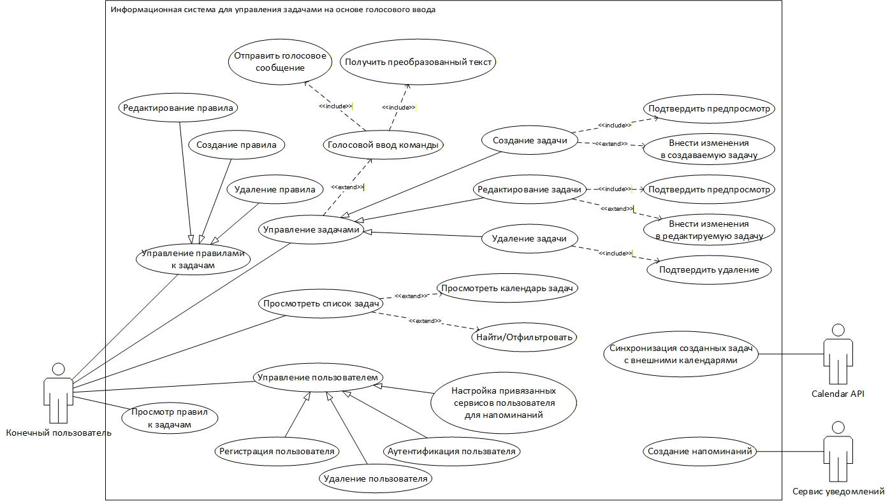

# Лабораторная работа №1

**Тема:** Формулирование требований к программной системе

**Цель работы:** Научиться анализировать поставленную задачу, формулировать функциональные и нефункциональные требования к проектируемой системе.

## Перечень заинтересованных лиц

1. *Конечные пользователи:* пользуются услугами программной системы.
2. *Владелец продукта:* определяет стратегию развития системы.
3. *Администратор:* настраивает, следит за работоспособностью системы.
4. *Люди ответственные за разработку и сопровождение:* отвечают за работоспособность системы.
5. *Заказчик:* учебное заведение, которое заинтересовано в подтверждении качества образовательного процесса.
6. *Регуляторные органы:* устанавливают законы и стандарты (например, законы о защите персональных данных).
## Перечень функциональных требований

1. Голосовой ввод команды
	1. Система должна предоставлять интерфейс для захвата голосовой команды пользователя.
	2. Преобразование голосового сообщения в текст.
	3. Выделение из распознанного текста сущностей: название задачи, дедлайн (дата и время), время напоминания.
2. Создание задачи
	1. Создание задачи голосовой командой.
	2. Создание задачи вручную.
	3. Создание предпросмотра внесенных параметров перед внесением информации о задаче в систему.
3. Редактирование задачи
	1. Редактирование задачи голосовой командой.
	2. Редактирование задачи вручную.
	3. Создание предпросмотра внесенных параметров перед внесением информации о задаче в систему.
4. Удаление задачи
	1. Удаление задачи голосовой командой.
	2. Удаление задачи вручную.
	3. Создание предупреждения об удалении задачи.
5. Создание напоминаний
	1. Создание напоминаний в мессенджере Телеграм.
	2. Создание напоминаний на почте.
6. Просмотр и фильтрация задач
	1. Отображение списка задач.
	2. Отображение созданных задач в виде календаря.
	3. Фильтры и поиск задач по дате, названию, статусу.
7. Управление пользователями
	1. Регистрация пользователя.
	2. Удаление пользователя.
	3. Аутентификация пользователя.
	4. Настройка привязанных сервисов для напоминаний.
8. Интеграция с внешними сервисами
	1. Синхронизация созданных задач с внешними календарями (Yandex).
9. Интеллектуальная обработка задач с помощью Rule Engine
	1. Автоматическое применение правил на основе распознанного текста и извлечённых сущностей.
	2. Возможность создания, редактирования и удаления правил через веб-интерфейс или админ-панель.
	3. Возможность просмотра правил в веб-интерфейсе.
	4. Каждое правило должно включать: триггер (WHEN), условие (IF) и действие (THEN).
	5. Возможность задания приоритетов правил для предотвращения конфликтов.
	6. Автоматическое выполнение действий: напоминания, автозаполнение полей задачи, синхронизация с календарём, уведомления.
## Диаграмма вариантов использования

## Перечень сделанных предположений

1. Изначально система должна ориентироваться на десятки или сотни пользователей, в будущем возможно система будет расширяться, потребуется возможность масштабирования вычислительных ресурсов.
2. Появление новых популярных календарей потребует процесса интеграции, требуется создать масштабируемую архитектуру, которая позволит быстро подстроиться под новые инструменты.
3. Доступ к аккаунту и данным должен быть защищен. Все пароли должны храниться в хешированном виде.
## Перечень нефункциональных требований

1. Производительность
	1. Время обработки голосового запроса не должно превышать **3 секунд** для 95% запросов.
	2. Точность автоматического распознавания речи для русскоязычных команд, относящихся к управлению задачами, должна составлять не менее 80%.
2. Гибкость и расширяемость
	1. Система должна быть спроектирована так, чтобы добавление новых сервисов для синхронизации (помимо Google Календаря) требовало минимальных усилий и не затрагивало основную логику приложения.
	2. Система должна быть способна одновременно обслуживать до 100 активных пользователей.
	3. Архитектура системы должна позволять масштабирование для обработки увеличенной нагрузки.
3. Безопасность
	1. Все аутентификационные данные и конфиденциальная информация пользователя (в том числе голосовые сообщения) должны храниться в зашифрованном виде.
4. Обработка ошибок
	1. Система должна корректно обрабатывать недоступность внешних сервисов.
	2. Система должна адекватно обрабатывать потерю сетевого соединения, уведомлять пользователя и принимать попытки переподключения.

Ключевые требования (5):
1. Точность автоматического распознавания речи для русскоязычных команд, относящихся к управлению задачами, должна составлять не менее 80%.
2. Система должна быть спроектирована так, чтобы добавление новых сервисов для синхронизации (помимо Google Календаря) требовало минимальных усилий и не затрагивало основную логику приложения.
3. Архитектура системы должна позволять масштабирование для обработки увеличенной нагрузки.
4. Все аутентификационные данные и конфиденциальная информация пользователя (в том числе голосовые сообщения) должны храниться в зашифрованном виде.
5. Система должна корректно обрабатывать недоступность внешних сервисов.