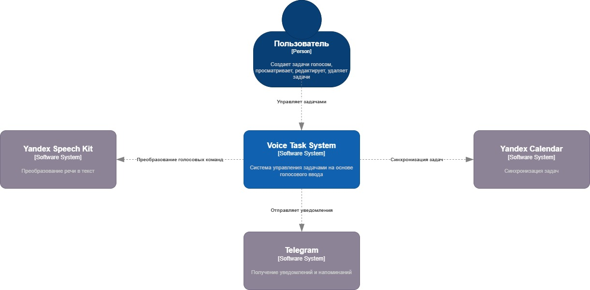
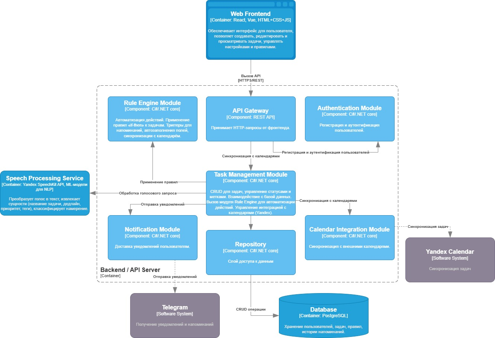
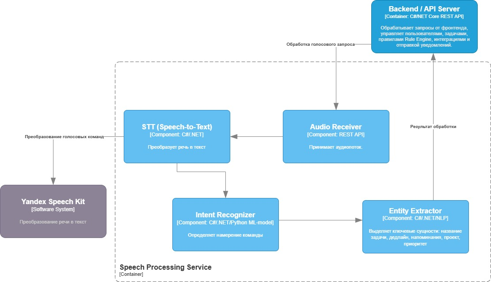

# Лабораторная работа №2

**Тема:** Использование нотации C4 model для проектирования архитектуры программной системы

**Цель работы:** Получить опыт использования графической нотации для фиксации архитектурных решений.

## Диаграмма системного контекста

- VTS (Voice Task System) - интеллектуальная система управления задачами с голосовым интерфейсом.
- Пользователь - создаёт, редактирует и удаляет задачи голосом или через веб-интерфейс; получает уведомления.
- Внешние календарные сервисы (Yandex Calendar) - получают события из системы для синхронизации задач.
- Сервисы уведомлений (Telegram) - получают команды для отправки напоминаний и уведомлений.
- Yandex Speech Kit - обрабатывает аудиозаписи и возвращает текст для NLP-модуля.
## Диаграмма контейнеров

- Web Frontend - веб-интерфейс.
- Backend / API Server - центральный контейнер с бизнес-логикой.
- Database (PostgreSQL) - хранение всех данных о задачах, пользователях, правилах и логах уведомлений.
- Speech Processing Service - получает аудио, возвращает обработанный текст.

Базовый архитектурный стиль - модульный монолит с вынесенным сервисом для обработки речи. Большая часть функциональности тесно связана и эффективнее реализуется внутри одного приложения без накладных расходов микросервисов. Отдельный контейнер для Speech Processing Service выделен из-за требовательности операций обработки аудио и NLP к ресурсам и возможности его независимого масштабирования без затрагивания остальной системы.
## Диаграмма компонентов

- API Gateway
- Authentication - отвечает за регистрацию, вход.
- Task Management Module - основной доменный модуль, который отвечает за создание, редактирование, удаление и получение задач.
- Notification Module - компонент, отвечающий за отправку уведомлений по доступным каналам.
- Calendar Integration Module - модуль, обеспечивающий синхронизацию задач с внешними календарями.
- Rule Engine - модуль отвечает за применение автоматизированных правил
- Repository - слой доступа к БД

- Audio Receiver - принимает аудиопоток.
- Speech-to-Text Engine - преобразует аудио в текст.
- Intent Recognizer - определяет намерение команды (создать задачу, редактировать и т.д.).
- Entity Extractor - выделяет ключевые сущности: название задачи, дедлайн, напоминания, проект, приоритет.