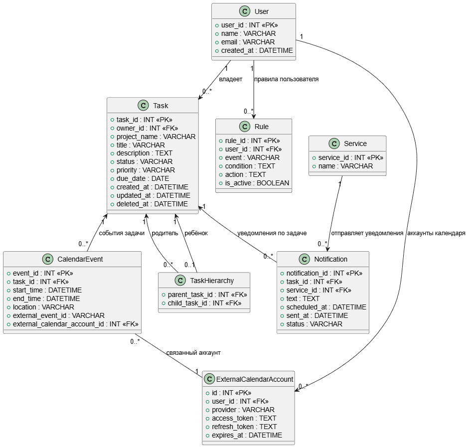

# Лабораторная работа №3

**Тема:** Использование принципов проектирования на уровне методов и классов

**Цель работы:** Получить опыт проектирования и реализации модулей с использованием принципов KISS, YAGNI, DRY, SOLID и др.

## Диаграмма контейнеров


- Web Frontend - веб-интерфейс.
- Backend / API Server - центральный контейнер с бизнес-логикой.
- Database (PostgreSQL) - хранение всех данных о задачах, пользователях, правилах и логах уведомлений.
- Speech Processing Service - получает аудио, возвращает обработанный текст.

Базовый архитектурный стиль - модульный монолит с вынесенным сервисом для обработки речи. Большая часть функциональности тесно связана и эффективнее реализуется внутри одного приложения без накладных расходов микросервисов. Отдельный контейнер для Speech Processing Service выделен из-за требовательности операций обработки аудио и NLP к ресурсам и возможности его независимого масштабирования без затрагивания остальной системы.
## Диаграмма компонентов


- API Gateway
- Authentication - отвечает за регистрацию, вход.
- Task Management Module - основной доменный модуль, который отвечает за создание, редактирование, удаление и получение задач.
- Notification Module - компонент, отвечающий за отправку уведомлений по доступным каналам.
- Calendar Integration Module - модуль, обеспечивающий синхронизацию задач с внешними календарями.
- Rule Engine - модуль отвечает за применение автоматизированных правил
- Repository - слой доступа к БД
## Диаграмма последовательностей


**Создание задачи голосом:** Пользователь инициирует создание задачи через голосовую команду в веб-интерфейсе. Система записывает аудио, обрабатывает его сервисом распознавания речи, анализирует текст, применяет пользовательские шаблоны и сохраняет черновик задачи. После подтверждения пользователем задача финализируется, создается уведомление о событии и событие добавляется в календарь. Пользователь получает подтверждение успешного создания задачи.

## Модель БД



- Пользователь (User) – владелец задач и правил.
- Задача (Task) – содержит все атрибуты задачи, включая название проекта как текстовую метку.
- Иерархия задач (TaskHierarchy) – реализует древовидную структуру подзадач; каждая задача может иметь одного родителя и несколько детей. Контроль отсутствия циклов реализуется на уровне бизнес-логики приложения.
- Календарное событие (CalendarEvent) – опционально, связано с задачей и внешним календарным аккаунтом.
- Правило (Rule) – пользовательские правила, интерпретируемые приложением; хранятся событие, условие и действие.
- Уведомление (Notification) – привязано к задаче и сервису отправки; поле `status` отражает жизненный цикл уведомления (`pending`, `sent`, `failed`).
- Сервис (Service) – система или сервис, отправляющий уведомления
- Внешний календарный аккаунт (ExternalCalendarAccount) – хранит ключи доступа для интеграции с внешними календарями.
## Применение основных принципов разработки

### **KISS** (Keep It Stupid Simple)

Пояснение: контроллер не перегружен логикой, все операции по валидации и обработке скрыты за названиями функций, понятно что выполняется и в каком порядке. Таким образом, код остаётся простым, легко читаемым и минимально сложным. *(Хотя это больше относится к принципу единственной ответственности, этот пример подходит и к демонстрации KISS)*.

```csharp
[ApiController]
[Route("api/[controller]")]
public class TaskController : ControllerBase
{
    private readonly CreateTaskHandler _handler;
    private readonly ILogger<TaskController> _logger;
    private readonly ITaskValidator _validator;

    public TaskController(
        CreateTaskHandler handler,
        ILogger<TaskController> logger,
        ITaskValidator validator)
    {
        _handler = handler;
        _logger = logger;
        _validator = validator;
    }

    [HttpPost]
	public async Task<IActionResult> CreateTask([FromBody] CreateTaskCommand command)
	{
	    try
	    {
	        _validator.Validate(command); 
	
	        _logger.LogInformation("Создание задачи для пользователя {UserId}", command.OwnerId);
	
	        var task = await _handler.Handle(command);
	
	        _logger.LogInformation("Задача {TaskId} успешно создана", task.TaskId);
	
	        return CreatedAtAction(nameof(CreateTask), task);
	    }
	    catch (ArgumentException ex)
	    {
	        return BadRequest(new { error = ex.Message });
	    }
	}
}
```

### **YAGNI** (You Ain't Gonna Need It)

Пояснение: в сущности Task есть поле ProjectName, но из Task не выделяется сущность Project, поскольку название проекта будет использоваться только для группировки, нет необходимости создавать отдельную сущность.

```csharp
public class Task
{
    public int TaskId { get; set; }
    public int OwnerId { get; set; }
    public string ProjectName { get; set; } // Не выделяется в отдельную сущность
    public string Title { get; set; }
    public string Description { get; set; }
    public string Status { get; set; }
    public DateTime CreatedAt { get; set; }
}
```

### **DRY** (Don’t Repeat Yourself)

Пояснение: проверка на пустое значение, используется в разных Features, может быть использовано множество раз.

```csharp
namespace Common;

public static class Guard
{
    public static void NotEmpty(string value, string fieldName)
    {
        if (string.IsNullOrWhiteSpace(value))
            throw new ArgumentException($"{fieldName} обязательно");
    }
}
```

### SOLID

#### Single Responsibility (Единственная ответственность)

Пояснение: каждый класс делает только одну вещь. Handler отвечает только за создание задачи.

```csharp
public class CreateTaskHandler
{
    private readonly ITaskRepository _repository;

    public CreateTaskHandler(ITaskRepository repository)
    {
        _repository = repository;
    }

    public Task Handle(CreateTaskCommand command)
    {
        var task = new Task
        {
            OwnerId = command.OwnerId,
            Title = command.Title,
            ProjectName = command.ProjectName,
            CreatedAt = DateTime.UtcNow,
            Status = "New"
        };
        return _repository.Save(task);
    }
}
```
#### Open/Closed (Открыт для расширения, закрыт для модификации)

Пояснение: для добавления нового способа хранения задач создаётся новая реализация интерфейса без изменения существующего кода.

```csharp
interface ITaskRepository
{
    void Save(Task task);
}

class InMemoryTaskRepository : ITaskRepository
{
    public void Save(Task task) { }
}

class PostgresTaskRepository : ITaskRepository
{
    public void Save(Task task) { }
}
```

#### Liskov Substitution (Подстановка Барбары Лисков)

Пояснение: любая реализация `ITaskRepository` может быть подставлена вместо другой без нарушения корректности работы метода.

```csharp
interface ITaskRepository
{
    void Save(Task task);
}

class InMemoryTaskRepository : ITaskRepository
{
    public void Save(Task task) { }
}

class PostgresTaskRepository : ITaskRepository
{
    public void Save(Task task) { }
}

void CreateTask(ITaskRepository repository)
{
    repository.Save(new Task());
}
```
#### Interface Segregation (Разделение интерфейсов)

Пояснение: интерфейсы разделены по сценариям использования, клиенты зависят только от необходимых им операций.

```csharp
interface ITaskReader
{
    TodoTask GetById(int id);
}

interface ITaskWriter
{
    void Save(Task task);
}
```

#### Dependency Inversion (Инверсия зависимостей)

Пояснение: бизнес-логика зависит от абстракции, а не от конкретной реализации хранилища данных.

```csharp
class TaskService
{
    private readonly ITaskRepository _repository;

    public TaskService(ITaskRepository repository)
    {
        _repository = repository;
    }
}
```

## Дополнительные принципы разработки

1. BDUF (Big design up front) - не применяется. Этот принцип предполагает полное проектирование системы до начала разработки. Он лучше всего реализуется, когда команда знает, что нужно сделать и как это сделать, в ином случае угадать наиболее оптимальные решения заранее практически невозможно. В условиях небольшого опыта в разработке неизбежно потребуется в будущем вносить изменения в архитектуру. В настоящем проекте архитектура будет более детально развиваться по мере понимания проекта и накопления опыта.
2. SoC (Separation оf concerns) - 100% применяется. Модульность частей программной системы позволяет быстро ориентироваться в программном коде (понимать его и сопровождать), позволяет избежать излишней связности (снижает риски при внесении изменений), упрощает тестирование и отладку.
3. MVP (Minimum viable product) - применяется. Поскольку заранее сложно оценить производительность программной системы, использующей машинное обучение и имеющей ограниченные ресурсы. Потребуется реализовать минимальный жизнеспособный продукт, чтобы оценить скорость его работы, удобство для конечного пользователя.
4. PoC (Proof of concept) - применяется. Требуется определить, возможно ли вообще с достаточной точностью выделять сущности из голосового сообщения, прежде чем разрабатывать полную систему.