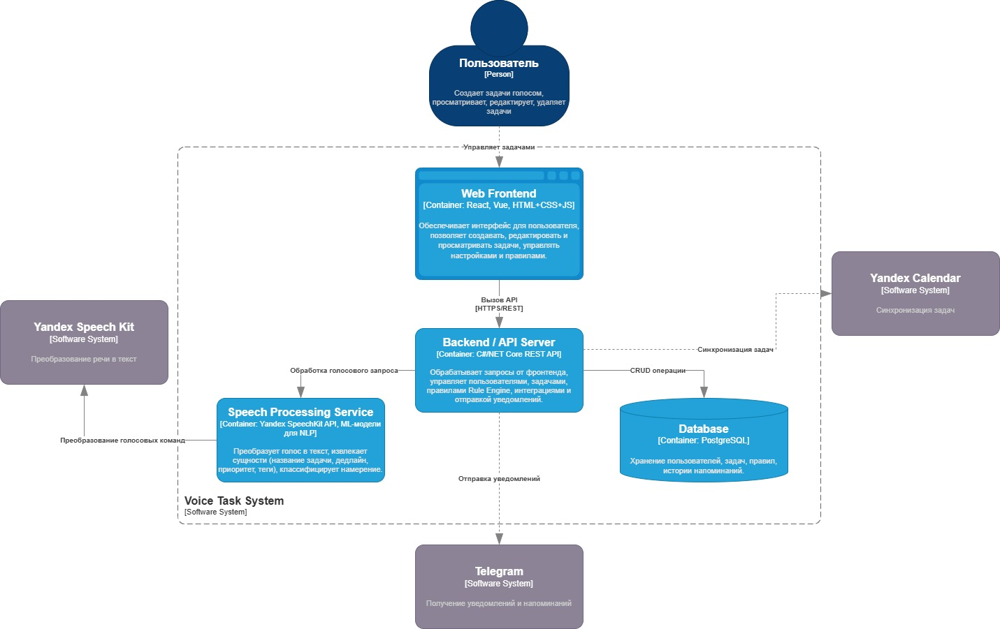
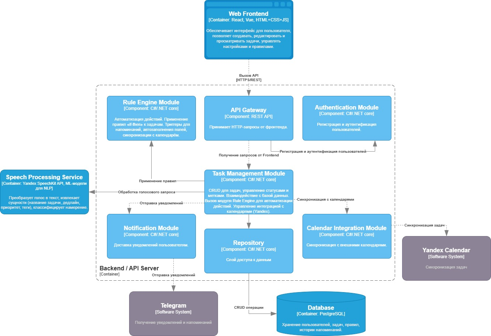
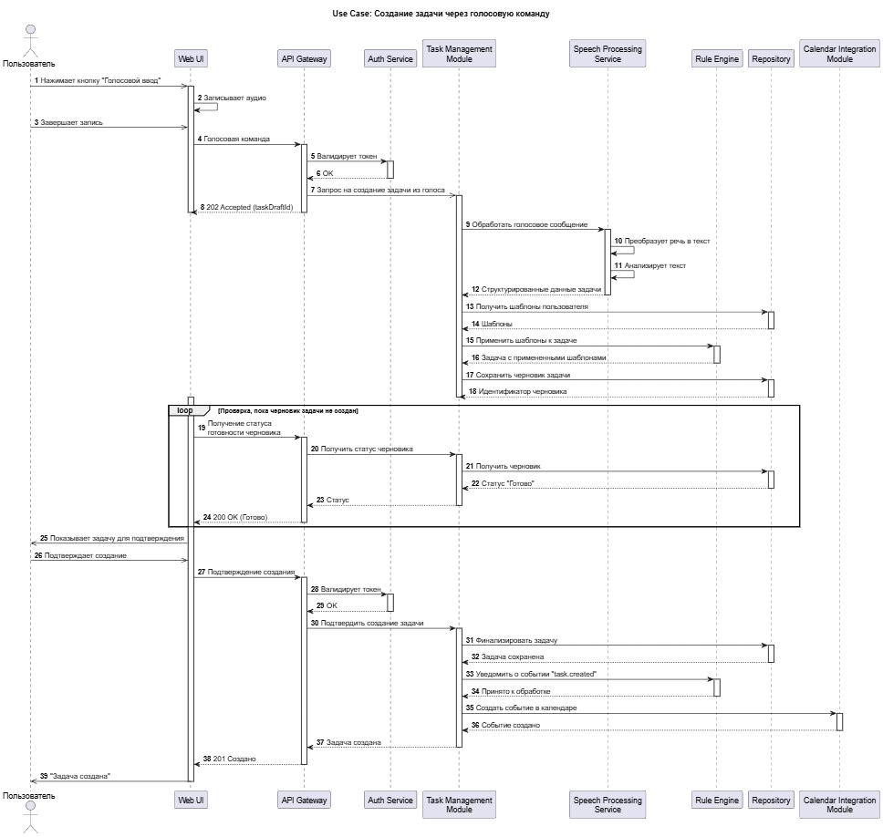

# Лабораторная работа №3

**Тема:** Использование принципов проектирования на уровне методов и классов

**Цель работы:** Получить опыт проектирования и реализации модулей с использованием принципов KISS, YAGNI, DRY, SOLID и др.

## Диаграмма контейнеров

## Диаграмма компонентов

- API Gateway
- Authentication - отвечает за регистрацию, вход.
- Task Management Module - основной доменный модуль, который отвечает за создание, редактирование, удаление и получение задач.
- Notification Module - компонент, отвечающий за отправку уведомлений по доступным каналам.
- Calendar Integration Module - модуль, обеспечивающий синхронизацию задач с внешними календарями.
- Rule Engine - модуль отвечает за применение автоматизированных правил
- Repository - слой доступа к БД
## Диаграмма последовательностей

**Создание задачи голосом:** Пользователь инициирует создание задачи через голосовую команду в веб-интерфейсе. Система записывает аудио, обрабатывает его сервисом распознавания речи, анализирует текст, применяет пользовательские шаблоны и сохраняет черновик задачи. После подтверждения пользователем задача финализируется, создается уведомление о событии и событие добавляется в календарь. Пользователь получает подтверждение успешного создания задачи.

## Модель БД

<Представить модель БД в виде диаграммы классов UML с краткими пояснениями>

## Применение основных принципов разработки

<Продемонстрировать фрагменты кода, пояснив какой принцип реализуется>

## Дополнительные принципы разработки

<По каждому принципу разработки из раздела повышенной сложности обосновать отказ или применение>