# Лабораторная работа №6

**Тема**: Использование шаблонов проектирования

**Цель работы**: Получить опыт применения шаблонов проектирования при написании кода программной системы.

## Шаблоны проектирования GoF

### 1. Порождающие шаблоны

#### 1.1. Singleton

**Общее назначение:**  
Гарантирует существование единственного экземпляра класса и предоставляет глобальную точку доступа к нему.

**Назначение в проекте:**  
`TelegramBotService` реализован как `BackgroundService` и регистрируется через `AddHostedService`, что обеспечивает singleton-время жизни, единственный экземпляр создаётся при старте приложения и живёт до его завершения. Гарантируется один экземпляр, управляющий подключением к Telegram API на всём протяжении работы приложения. Контроль единственности передан DI-контейнеру в .NET.

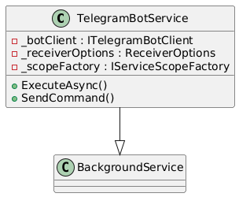

```csharp
public class TelegramBotService : BackgroundService, IBotService
{
    private readonly ITelegramBotClient _botClient;
    private readonly ReceiverOptions _receiverOptions;
    private readonly IServiceScopeFactory _scopeFactory;

    public TelegramBotService(IServiceScopeFactory scopeFactory, IOptions<TelegramBotConfig> config)
    {
        _botClient = new TelegramBotClient(config.Value.AuthToken);
        _receiverOptions = new ReceiverOptions 
        {
            AllowedUpdates =
            [
                UpdateType.Message,
            ],
            DropPendingUpdates = true,
        };
        _scopeFactory = scopeFactory;
    }

    protected override async Task ExecuteAsync(CancellationToken stoppingToken)
    {
        // UpdateHander - обработчик приходящих Update`ов
        // ErrorHandler - обработчик ошибок, связанных с Bot API
        await _botClient.ReceiveAsync(UpdateHandler, ErrorHandler, _receiverOptions, stoppingToken); // Запускаем бота
    }

    private async Task UpdateHandler(ITelegramBotClient botClient, Telegram.Bot.Types.Update update, CancellationToken cancellationToken)
    {
        try
        {
            // Тут обрабатываем приходящие Update`ы
            if (update.Type == UpdateType.Message && update.Message!.Type == MessageType.Text) // Если пришло текстовое сообщение
            {
                var chatId = update.Message.Chat.Id; // Получаем Id чата, из которого пришло сообщение
                var messageText = update.Message.Text; // Получаем текст сообщения
                Console.WriteLine($"Received a message from chat {chatId}: {messageText}");

                using var scope = _scopeFactory.CreateScope();
                
                // Пример ответа на сообщение
                await SendCommand(chatId, "Message Recieved", stoppingToken: cancellationToken);
            }

        }
        catch (Exception ex)
        {
            Console.WriteLine($"Error in UpdateHandler: {ex.Message}");
        }
    }

    private static Task ErrorHandler(ITelegramBotClient botClient, Exception exception, CancellationToken cancellationToken)
    {
        // Тут обрабатываем ошибки, связанные с Bot API
        Console.WriteLine($"An error occurred: {exception.Message}");
        return Task.CompletedTask;
    }

    public async Task SendCommand(long chatId, string command, CancellationToken stoppingToken)
    {
        await _botClient.SendMessage(chatId, command, cancellationToken: stoppingToken);
    }
}

```

#### 1.2. Factory Method

**Общее назначение:**  
Определяет интерфейс для создания объекта, но позволяет подклассам решать, какой конкретный класс создавать. Позволяет делегировать создание объектов и скрыть конкретные реализации.

**Назначение в проекте:**  
В зависимости от окружения (`Development` или `Production`) создаётся нужная реализация `IEmailService`. `FakeEmailServiceFactory` используется при разработке и пишет письма в лог, `SmtpEmailServiceFactory` предусмотрена для production.

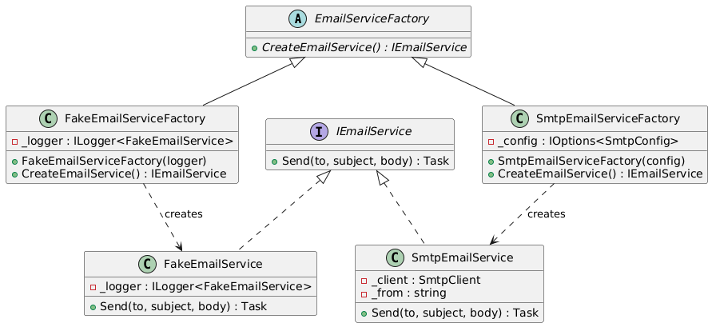

```csharp
// Абстрактный создатель
public abstract class EmailServiceFactory
{
    public abstract IEmailService CreateEmailService();
}

// Конкретный создатель для разработки
public class FakeEmailServiceFactory : EmailServiceFactory
{
    private readonly ILogger<FakeEmailService> _logger;

    public FakeEmailServiceFactory(ILogger<FakeEmailService> logger)
    {
        _logger = logger;
    }

    public override IEmailService CreateEmailService()
        => new FakeEmailService(_logger);
}

// Конкретный создатель для продакшена
public class SmtpEmailServiceFactory : EmailServiceFactory
{
    private readonly IOptions<SmtpConfig> _config;

    public SmtpEmailServiceFactory(IOptions<SmtpConfig> config)
    {
        _config = config;
    }

    public override IEmailService CreateEmailService()
        => new SmtpEmailService(_config);
}
```

#### 1.3. Builder

**Общее назначение:**  
Позволяет создавать сложный объект пошагово, отделяя процесс построения от представления объекта.

**Назначение в проекте:**  
Используется для создания доменной сущности `TaskItem`, содержащей множество свойств и опциональных параметров. Builder инкапсулирует процесс создания и обеспечивает базовую доменную валидацию перед сохранением объекта.

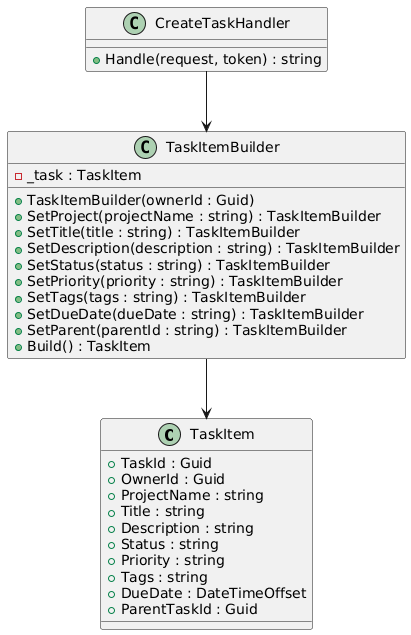

```csharp
public class TaskItemBuilder
{
    private readonly TaskItem _task;

    public TaskItemBuilder(Guid ownerId)
    {
        if (ownerId == Guid.Empty)
            throw new ArgumentException("OwnerId is required");

        _task = new TaskItem
        {
            TaskId = Guid.NewGuid(),
            OwnerId = ownerId,
            CreatedAt = DateTimeOffset.UtcNow,
            Status = "Pending"
        };
    }

    public TaskItemBuilder SetTitle(string title)
    {
        if (string.IsNullOrWhiteSpace(title))
            throw new ArgumentException("Title is required");
        _task.Title = title;
        return this;
    }

    public TaskItemBuilder SetDescription(string? description)
    {
        _task.Description = description ?? string.Empty;
        return this;
    }

    // SetProject, SetStatus, SetPriority, SetTags, SetDueDate, SetParent — по аналогии

    public TaskItem Build() => _task;
}

// Использование
public async Task<string> Handle(CreateTaskCommand request, CancellationToken cancellationToken)
{
    var task = new TaskItemBuilder(_user.UserId)
        .SetProject(request.ProjectName)
        .SetTitle(request.Title)
        .SetDescription(request.Description)
        .SetStatus(request.Status)
        .SetPriority(request.Priority)
        .SetTags(request.Tags)
        .SetDueDate(request.DueDate)
        .SetParent(request.ParentTaskId)
        .Build();

    await _context.AddAsync(task, cancellationToken);
    await _context.SaveChangesAsync(cancellationToken);

    _logger.LogInformation("Created task with id {TaskId}", task.TaskId);
    return task.TaskId.ToString();
}
```
### 2. Структурные шаблоны

#### 2.1. Decorator

**Общее назначение:**  
Позволяет динамически добавлять объекту новое поведение, оборачивая его в другой объект, реализующий тот же интерфейс.

**Назначение в проекте:**  
`RetryBotService` оборачивает реальную реализацию `IBotService` (`TelegramBotAdapter`), добавляя логику повторных попыток при сбое отправки сообщения. Клиенты работают с тем же интерфейсом `IBotService`, не зная о наличии retry-логики.

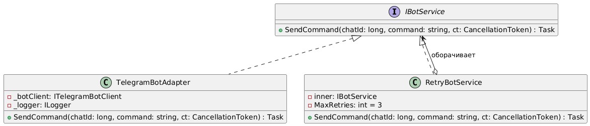

```csharp
public class RetryBotService(IBotService inner, ILogger<RetryBotService> logger) : IBotService
{
    private const int MaxRetries = 3;

    public async Task SendCommand(long chatId, string command, CancellationToken ct)
    {
        for (int attempt = 1; attempt <= MaxRetries; attempt++)
        {
            try
            {
                await inner.SendCommand(chatId, command, ct);
                return;
            }
            catch (Exception ex) when (attempt < MaxRetries)
            {
                logger.LogWarning(
                    "Attempt {Attempt} failed: {Error}. Retrying...",
                    attempt,
                    ex.Message);
                await Task.Delay(500 * attempt, ct);
            }
        }
    }
}

// Регистрация в DI
builder.Services.AddSingleton<TelegramBotAdapter>();
builder.Services.AddSingleton<IBotService>(sp =>
    new RetryBotService(
        sp.GetRequiredService<TelegramBotAdapter>(),
        sp.GetRequiredService<ILogger<RetryBotService>>()
    ));
```

#### 2.2. Adapter

**Общее назначение:**  
Позволяет объектам с несовместимыми интерфейсами работать вместе, преобразуя интерфейс одного класса в интерфейс, ожидаемый клиентом.

**Назначение в проекте:**  
Класс `TelegramBotAdapter` адаптирует внешний интерфейс `ITelegramBotClient` к внутреннему интерфейсу `IBotService`, используемому в приложении. Это позволяет при необходимости заменить Telegram на другой мессенджер без изменения бизнес-логики.

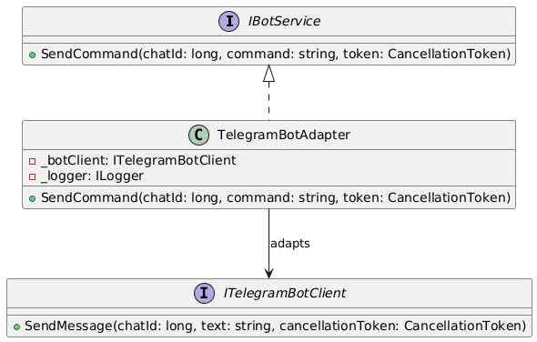

```csharp
public class TelegramBotAdapter(ITelegramBotClient botClient, ILogger<TelegramBotAdapter> logger) : IBotService
{
    private readonly ITelegramBotClient _botClient = botClient;
    private readonly ILogger<TelegramBotAdapter> _logger = logger;

    public async Task SendCommand(long chatId, string command, CancellationToken stoppingToken)
    {
        _logger.LogInformation("Send message to chat {ChatId}", chatId);
        await _botClient.SendMessage(chatId, command, cancellationToken: stoppingToken);
    }
}
```

#### 2.3. Proxy

**Общее назначение:**  
Позволяет контролировать доступ к объекту, добавляя проверку, кэширование, ленивую инициализацию или другие вспомогательные действия, сохраняя тот же интерфейс.

**Назначение в проекте:**  
Перед отправкой команды в Telegram через `TelegramBotAdapter` проверяется валидность ID чата в мессенджере через прокси `BotServiceProxy`.

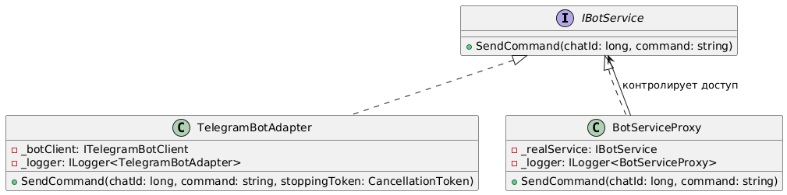

```csharp
public interface IBotService
{
    Task SendCommand(long chatId, string command, CancellationToken stoppingToken);
}

public class TelegramBotAdapter(ITelegramBotClient botClient, ILogger<TelegramBotAdapter> logger) : IBotService
{
    private readonly ITelegramBotClient _botClient = botClient;
    private readonly ILogger<TelegramBotAdapter> _logger = logger;

    public async Task SendCommand(long chatId, string command, CancellationToken stoppingToken)
    {
        _logger.LogInformation("Send message to chat {ChatId}", chatId);
        await _botClient.SendMessage(chatId, command, cancellationToken: stoppingToken);
    }
}

// Proxy
public class BotServiceProxy(IBotService realService, ILogger<BotServiceProxy> logger) : IBotService
{
    private readonly IBotService _realService = realService;
    private readonly ILogger<BotServiceProxy> _logger = logger;

    public async Task SendCommand(long chatId, string command, CancellationToken stoppingToken)
    {
        // Проверка доступа
        if (chatId <= 0)
        {
            _logger.LogWarning("Access denied: invalid chatId {ChatId}", chatId);
            return;
        }

        await _realService.SendCommand(chatId, command);
    }
}
```

#### 2.4. Facade

**Общее назначение:**  
Facade предоставляет упрощённый единый интерфейс к сложной подсистеме, скрывая внутренние детали и облегчая работу клиента.

**Назначение в проекте:**  
`SpeechProcessingService` объединяет `IntentClassificationService` и `EntityExtractionService`. Клиенту достаточно вызвать один метод `ProcessCommand`, чтобы получить результат классификации и извлечённые сущности, не зная о внутренней работе ML-моделей.

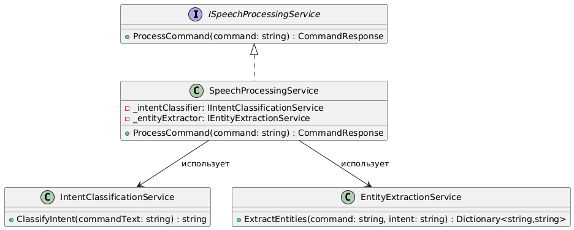

```csharp
public class SpeechProcessingService : ISpeechProcessingService
{
    private readonly IIntentClassificationService _intentClassifier;
    private readonly IEntityExtractionService _entityExtractor;

    public SpeechProcessingService(
        IIntentClassificationService intentClassifier,
        IEntityExtractionService entityExtractor)
    {
        _intentClassifier = intentClassifier;
        _entityExtractor = entityExtractor;
    }

    public CommandResponse ProcessCommand(string command)
    {
        var intent = _intentClassifier.ClassifyIntent(command);
        Dictionary<string, string> parameters = new();

        if (intent == "create_task" || intent == "delete_task")
        {
            parameters = _entityExtractor.ExtractEntities(command, intent);
        }

        parameters.Add("intent", intent);
        return new CommandResponse(Guid.NewGuid(), parameters);
    }
}
```
### 3. Поведенческие шаблоны

#### 3.1. Command

**Общее назначение:**  
Инкапсулирует запрос в виде отдельного объекта, позволяя параметризовать клиентов различными запросами и логировать их.

**Назначение в проекте:**  
В проекте команды (например, `CreateTaskCommand`) инкапсулируют данные запроса, а обработчики (`CreateTaskCommandHandler`) выполняют бизнес-логику. Отправка команды осуществляется через `IMediator`.

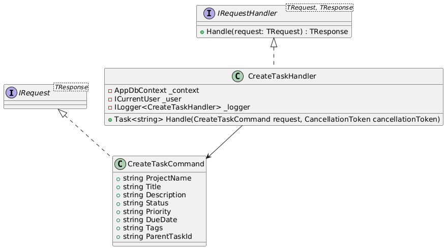

```csharp
public sealed record CreateTaskCommand(
    string ProjectName,
    string Title,
    string Description,
    string Status,
    string Priority,
    string DueDate,
    string Tags,
    string ParentTaskId
    ) : IRequest<string>;
```
#### 3.2. Chain of Responsibility

**Общее назначение:**  
Позволяет передавать запрос по цепочке обработчиков, пока один из них не обработает его.

**Назначение в проекте:**  
`ValidationBehavior<TRequest,TResponse>` является звеном цепочки обработки запроса. Он выполняет валидацию и передаёт управление следующему обработчику через `next()`.

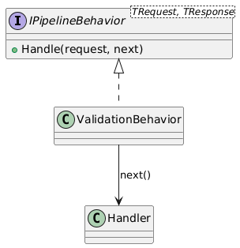

```csharp
public class ValidationBehavior<TRequest, TResponse> : IPipelineBehavior<TRequest, TResponse>
    where TRequest : IRequest<TResponse>
{
    private readonly IEnumerable<IValidator<TRequest>> validators;

    public async Task<TResponse> Handle(
        TRequest request,
        RequestHandlerDelegate<TResponse> next,
        CancellationToken cancellationToken)
    {
        if (validators.Any())
        {
            var context = new ValidationContext<TRequest>(request);
            var validationFailures = await Task.WhenAll(
                validators.Select(v => v.ValidateAsync(context, cancellationToken)));

            var errors = validationFailures.SelectMany(f => f.Errors).Where(f => f != null).ToList();
            if (errors.Count != 0) throw new ValidationAppException("Validation failed");
        }

        // Вызов следующего обработчика
        return await next(cancellationToken);
    }
}
```
#### 3.3. Mediator

**Общее назначение:**  
Централизует взаимодействие между объектами, уменьшая связанность между ними.

**Назначение в проекте:**  
Контроллеры не вызывают обработчики напрямую, а отправляют команды через `IMediator`, который определяет, какой обработчик должен выполнить запрос.

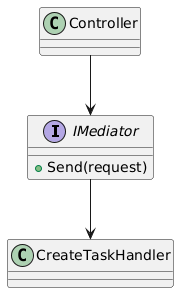

```csharp
public class TaskItemController(IMediator mediator) : ControllerBase
{
    private readonly IMediator _mediator = mediator;

    [HttpPost]
    public async Task<IActionResult> Create(CreateTaskCommand command)
    {
        var id = await _mediator.Send(command);
        return Created(id);
    }
}
```

#### 3.4. Template Method

**Общее назначение:**  
Определяет скелет алгоритма в базовом классе, позволяя переопределять отдельные шаги алгоритма, не изменяя его общей структуры.

**Назначение в проекте:**  
`BaseEventHandler<TEvent>` реализует общий алгоритм обработки событий: логирование событий в `Log(notification)`, абстрактный шаг `Process(notification)`, который переопределяется в конкретных обработчиках для специфической логики.

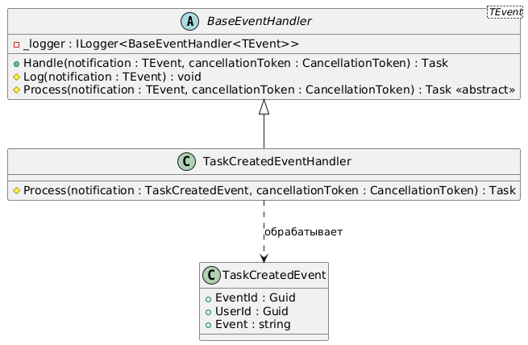

```csharp
public abstract class BaseEventHandler<TEvent>(ILogger<BaseEventHandler<TEvent>> logger) : INotificationHandler<TEvent> where TEvent : BaseEvent
{
    private readonly ILogger<BaseEventHandler<TEvent>> _logger = logger;

    public async Task Handle(TEvent notification, CancellationToken cancellationToken)
    {
        Log(notification);
        await Process(notification, cancellationToken);
    }

    protected virtual void Log(TEvent notification)
    {
        _logger.LogInformation("Event {EventId} | {Event} | User {UserId}", notification.EventId, notification.Event, notification.UserId);
    }

    protected abstract Task Process(TEvent notification, CancellationToken cancellationToken);
}

public class TaskCreatedEventHandler(ILogger<TaskCreatedEventHandler> logger) : BaseEventHandler<TaskCreatedEvent>(logger)
{
    private readonly ILogger<TaskCreatedEventHandler> _logger = logger;

    protected override Task Process(TaskCreatedEvent notification, CancellationToken cancellationToken)
    {
        _logger.LogInformation(
            "[PUSH] Уведомление для пользователя {UserId}: Задача '{Title}' создана (ID {TaskId})",
            notification.UserId,
            notification.Title,
            notification.TaskId);
        return Task.CompletedTask;
    }
}
```

#### 3.5. Observer

**Общее назначение:**  
Определяет зависимости «один-ко-многим» между объектами, чтобы при изменении состояния одного объекта все зависимые объекты автоматически уведомлялись.

**Назначение в проекте:**  
Observer реализован через MediatR: `TaskCreatedEvent` событие (Subject), которое публикуется после успешного создания задачи. `TaskCreatedEmailHandler` и `TaskCreatedPushHandler` обработчики (Observers), подписанные на событие. При публикации события (`_mediator.Publish`) все обработчики автоматически получают уведомление и выполняют свою логику: `TaskCreatedEmailHandler` отправляет email пользователю, `TaskCreatedPushHandler` имитирует push-уведомление через ILogger.

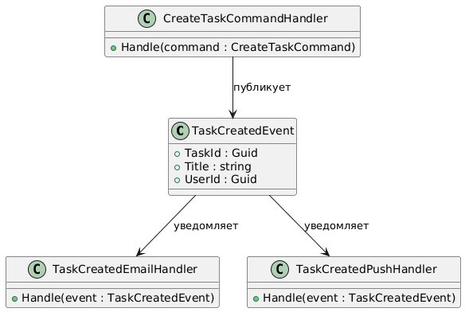

```csharp
public async Task<string> Handle(CreateTaskCommand request, CancellationToken cancellationToken)
{
    var task = new TaskItem()
    ...
    await _context.AddAsync(task, cancellationToken);
    await _context.SaveChangesAsync(cancellationToken);
    ...
    await _mediator.Publish(new TaskCreatedEvent(task.TaskId, _user.UserId, task.Title), cancellationToken); // публикация
    ...
}

// Событие
public sealed class TaskCreatedEvent(Guid TaskId, Guid OwnerId, string? Title) : BaseEvent
{
    public Guid TaskId { get; init; } = TaskId;
    public string? Title { get; init; } = Title;
    public override Guid UserId { get; init; } = OwnerId;
    public override string Event { get; init; } = nameof(TaskCreatedEvent);
}

// Получение события для уведомления на почту
public class TaskCreatedEmailHandler(ILogger<BaseEventHandler<TaskCreatedEvent>> logger, IEmailService emailService, UserManager<User> userManager) : BaseEventHandler<TaskCreatedEvent>(logger)
{
    private readonly IEmailService _emailService = emailService;
    private readonly UserManager<User> _userManager = userManager;

    protected override async Task Process(TaskCreatedEvent notification, CancellationToken cancellationToken)
    {
        var user = await _userManager.FindByIdAsync(notification.UserId.ToString());
        if (user == null) return;
        if (user.Email == null) return;
        if (!user.EmailConfirmed) return;

        await _emailService.Send(
            user.Email,
            "Создана новая задача",
            $"Задача '{notification.Title}' была создана с ID {notification.TaskId}");
    }
}

// Получение события для push уведомления
public class TaskCreatedPushHandler(ILogger<TaskCreatedPushHandler> logger) : BaseEventHandler<TaskCreatedEvent>(logger)
{
    private readonly ILogger<TaskCreatedPushHandler> _logger = logger;

    protected override Task Process(TaskCreatedEvent notification, CancellationToken cancellationToken)
    {
        _logger.LogInformation(
            "[PUSH] Уведомление для пользователя {UserId}: Задача '{Title}' создана (ID {TaskId})",
            notification.UserId,
            notification.Title,
            notification.TaskId);
        return Task.CompletedTask;
    }
}
```
## Шаблоны проектирования GRASP

### 1. Роли (обязанности) классов

#### 1.1. Information Expert

**Проблема:** 
Кому назначить ответственность за извлечение `UserId` и статуса аутентификации текущего пользователя? Нужно найти того, кто уже владеет необходимой информацией.

**Решение:**
`HttpCurrentUser` владеет `IHttpContextAccessor`, а значит только он знает, как достать `UserId` из HTTP-контекста. Назначаем ответственность ему, он и есть информационный эксперт.

```csharp
public sealed class HttpCurrentUser : ICurrentUser
{
    private readonly IHttpContextAccessor _accessor;

    public HttpCurrentUser(IHttpContextAccessor accessor)
    {
        _accessor = accessor;
    }

    public Guid UserId => Guid.Parse(
    _accessor.HttpContext!.User.FindFirstValue(ClaimTypes.NameIdentifier)!);

    public bool IsAuthenticated =>
        _accessor.HttpContext?.User?.Identity?.IsAuthenticated == true;
}
```

**Результат:**
Логика извлечения `UserId` там, где живут данные. Никто снаружи не лезет в `HttpContext` напрямую, контроллеры и обработчики просто вызывают `_currentUser.UserId`, не зная откуда он берётся.

**Связь с другими паттернами:**
Поддерживает High Cohesion, данные и логика работы с ними находятся в одном классе. Поддерживает Low Coupling, внешний код не знает деталей извлечения данных, зависит только от интерфейса.

#### 1.2. Creator

**Проблема:** 
Существует два объекта `HttpCurrentUser` и `TelegramCurrentUser`, требуется создавать один из них, в зависимости от источника запроса. Если каждый раз в обработчике проверять источник, то получится много дублирования кода, сложно масштабировать решение.

**Решение:**
`CurrentUserProvider` содержит оба accessor-а и имеет всю необходимую информацию для решения, какой объект создать. Значит именно он и должен быть ответственным за создание.

```csharp
public sealed class CurrentUserProvider : ICurrentUserProvider
{
    private readonly IHttpContextAccessor _httpContextAccessor;
    private readonly ITelegramContextAccessor _telegramAccessor;

    public ICurrentUser GetCurrentUser()
    {
        if (_httpContextAccessor.HttpContext?.User?.Identity?.IsAuthenticated == true)
            return new HttpCurrentUser(_httpContextAccessor);

        if (_telegramAccessor.Update != null)
            return new TelegramCurrentUser(_telegramAccessor);

        throw new InvalidOperationException("Не удалось определить источник пользователя");
    }
}
```

**Результат:**
Логика создания объектов сосредоточена в одном месте. При добавлении нового источника изменяется только `CurrentUserProvider`.

**Связь с другими паттернами:**
Поддерживает Low Coupling, клиенты не создают `HttpCurrentUser` или `TelegramCurrentUser` сами, они получают готовый `ICurrentUser` и не знают деталей создания.

#### 1.3. Controller

**Проблема:** 
Кто-то должен принимать запросы (HTTP) и координировать выполнение логики. Если логика находится прямо в точке входа, то нарушается разделение ответственностей.

**Решение:**
`TaskItemController` принимает входящий запрос и делегирует выполнение через `IMediator`, не содержа бизнес-логики.

```csharp
public class TaskItemController(IMediator mediator) : ControllerBase
{
    private readonly IMediator _mediator = mediator;

    [HttpPost]
    public async Task<IActionResult> Create(CreateTaskCommand command)
    {
        // Контроллер только принимает запрос и делегирует
        var id = await _mediator.Send(command);
        return Created(id);
    }
}
```

**Результат:**
Контроллер выполняет роль тонкого слоя между UI и бизнес-логикой. Бизнес-логика не зависит от способа доставки запроса.

**Связь с другими паттернами:**
Использует Indirection через `IMediator`. Поддерживает Low Coupling, контроллер не знает о конкретных обработчиках команд.

#### 1.4. Pure Fabrication

**Проблема:** 
Логика определения источника текущего пользователя (HTTP или Telegram) не принадлежит ни одной доменной сущности, но где-то должна жить.

**Решение:**
Создать искусственный технический класс `CurrentUserProvider`, не имеющий аналога в предметной области, который содержит эту логику.

```csharp
public sealed class CurrentUserProvider : ICurrentUserProvider
{
    private readonly IHttpContextAccessor _httpContextAccessor;
    private readonly ITelegramContextAccessor _telegramAccessor;

    public ICurrentUser GetCurrentUser()
    {
        if (_httpContextAccessor.HttpContext?.User?.Identity?.IsAuthenticated == true)
            return new HttpCurrentUser(_httpContextAccessor);

        if (_telegramAccessor.Update != null)
            return new TelegramCurrentUser(_telegramAccessor);

        throw new InvalidOperationException("Не удалось определить источник пользователя");
    }
}
```

**Результат:**
Логика определения источника пользователя сосредоточена в одном месте и не засоряет обработчики команд.

**Связь с другими паттернами:**
Является средством достижения Low Coupling и High Cohesion, искусственный класс появляется именно тогда, когда нужно снять лишнюю ответственность с доменных объектов. Реализует Indirection, выступая посредником между обработчиками команд и конкретными источниками пользователя.

#### 1.5. Indirection

**Проблема:** 
Если `TaskItemController` напрямую вызывает `CreateTaskCommandHandler` контроллер жёстко привязан к конкретному обработчику. Добавление валидации, логирования или кэширования потребует изменения контроллера.

**Решение:**
Ввести посредника `IMediator`. Контроллер отправляет команду через медиатор, который сам находит нужный обработчик и пропускает запрос через pipeline.

```csharp
// Контроллер знает только о IMediator
public class TaskItemController(IMediator mediator) : ControllerBase
{
    [HttpPost]
    public async Task<IActionResult> Create(CreateTaskCommand command)
    {
        var id = await _mediator.Send(command); // не знает кто обработает
        return Created(id);
    }
}

// Медиатор автоматически строит цепочку:
// ValidationBehavior → CreateTaskCommandHandler
// Контроллер об этом ничего не знает
```

**Результат:**
Контроллер полностью изолирован от конкретных обработчиков. Новые поведения (кэширование, логирование) добавляются в pipeline без изменения контроллера или обработчиков.

**Связь с другими паттернами:**
Реализует Mediator из GoF.


### 2. Принципы разработки

#### 2.1. Low Coupling

**Проблема:** 
Если `TelegramBotService` напрямую использует `ITelegramBotClient` во всей бизнес-логике, тогда замена мессенджера потребует изменений по всему коду.

**Решение:**
Ввести интерфейс `IBotService`. Бизнес-логика зависит только от абстракции, а `TelegramBotAdapter` изолирует конкретную реализацию.

```csharp
// Интерфейс — стабильная абстракция
public interface IBotService
{
    Task SendCommand(long chatId, string command, CancellationToken stoppingToken);
}

// Адаптер изолирует зависимость от Telegram
public class TelegramBotAdapter : IBotService
{
    private readonly ITelegramBotClient _botClient;

    public async Task SendCommand(long chatId, string command, CancellationToken stoppingToken)
    {
        await _botClient.SendMessage(chatId, command, cancellationToken: stoppingToken);
    }
}

// Прокси тоже зависит только от интерфейса, не от Telegram
public class BotServiceProxy : IBotService
{
    private readonly IBotService _realService; // зависимость от абстракции

    public async Task SendCommand(long chatId, string command)
    {
        if (chatId <= 0) return;
        await _realService.SendCommand(chatId, command);
    }
}
```

**Результат:**
Замена Telegram на другой мессенджер требует создания нового адаптера, но не затрагивает бизнес-логику. Компоненты можно тестировать независимо через mock-объекты.

**Связь с другими паттернами:**
Реализуется через Adapter из GoF.

#### 2.2. High Cohesion

**Проблема:** 
Если `SpeechProcessingService` сам занимается и классификацией намерений, и извлечением сущностей, и формированием ответа, тогда класс становится перегруженным и сложным для поддержки.

**Решение:**
Разделить ответственности: `IntentClassificationService` занимается только классификацией, `EntityExtractionService` только извлечением сущностей, а `SpeechProcessingService` только координирует их работу.

```csharp
// Каждый класс делает одно конкретное дело
public class SpeechProcessingService : ISpeechProcessingService
{
    private readonly IIntentClassificationService _intentClassifier; // только классификация
    private readonly IEntityExtractionService _entityExtractor;      // только извлечение сущностей

    public CommandResponse ProcessCommand(string command)
    {
        // SpeechProcessingService только координирует
        var intent = _intentClassifier.ClassifyIntent(command);
        
        Dictionary<string, string> parameters = new();
        if (intent == "create_task" || intent == "delete_task")
        {
            parameters = _entityExtractor.ExtractEntities(command, intent);
        }

        parameters.Add("intent", intent);
        return new CommandResponse(Guid.NewGuid(), parameters);
    }
}
```

**Результат:**
Каждый класс имеет чёткую и понятную ответственность. Изменение алгоритма классификации не затрагивает логику извлечения сущностей.

**Связь с другими паттернами:**
Достигается через Pure Fabrication, `IntentClassificationService` и `EntityExtractionService` это искусственно выделенные классы, которые появились именно ради повышения связности. Усиливает Low Coupling, когда каждый класс делает только своё, зависимостей между ними становится меньше.

#### 2.3. Polymorphism

**Проблема:** 
Если получение текущего пользователя реализовать через `if/switch` по типу источника (HTTP или Telegram), код будет разрастаться, появится жёсткая связанность и нарушение OCP.

**Решение:**
Использовать общий интерфейс `ICurrentUser` и реализовать разное поведение в отдельных классах (`HttpCurrentUser`, `TelegramCurrentUser`). Выбор поведения происходит через полиморфизм, без условных операторов.

```csharp
public interface ICurrentUser
{
    Guid UserId { get; }
    bool IsAuthenticated { get; }
}

public sealed class HttpCurrentUser : ICurrentUser
{
    private readonly IHttpContextAccessor _accessor;

    public Guid UserId =>
        Guid.Parse(_accessor.HttpContext!
            .User.FindFirstValue(ClaimTypes.NameIdentifier)!);

    public bool IsAuthenticated =>
        _accessor.HttpContext?.User?.Identity?.IsAuthenticated == true;
}

public sealed class TelegramCurrentUser : ICurrentUser
{
    private readonly ITelegramContextAccessor _telegramAccessor;

    public Guid UserId => _telegramAccessor.Update!.Id;
    public bool IsAuthenticated => true;
}
```

**Результат:**
Добавление нового способа получения `UserId` достигается созданием нового класса, а не изменением существующего. Соблюдается принцип Open/Closed.

**Связь с другими паттернами:**
- Information Expert - каждый класс сам знает, как получить данные
- Protected Variations - система защищена от изменений источника пользователя
- Low Coupling - зависимость только от интерфейса

### 3. Свойство программы (цель)

#### 3.1. Protected Variations

**Проблема:** 
В системе есть нестабильные точки: источник пользователя (HTTP/Telegram), мессенджер (Telegram/VK), способ уведомления (email/push). Изменения в этих местах не должны распространяться по всей системе.

**Решение:**
Каждая нестабильная точка скрывается за стабильным интерфейсом. 

```csharp
// Нестабильная точка 1: источник пользователя
// Защита: интерфейс ICurrentUser
public interface ICurrentUser
{
    Guid UserId { get; }
    bool IsAuthenticated { get; }
}
// Обработчики команд не знают — HTTP это или Telegram
public sealed class CreateTaskCommandHandler
{
    private readonly ICurrentUser _user; // работает с абстракцией
}

// Нестабильная точка 2: мессенджер
// Защита: интерфейс IBotService
public interface IBotService
{
    Task SendCommand(long chatId, string command, CancellationToken stoppingToken);
}
// Меняем Telegram на VK — создаём новый адаптер, бизнес-логика не меняется
public class VKBotAdapter : IBotService { ... }

// Нестабильная точка 3: способ обработки события
// Защита: абстрактный BaseEventHandler<TEvent>
public abstract class BaseEventHandler<TEvent> : INotificationHandler<TEvent>
{
    protected abstract Task Process(TEvent notification, CancellationToken cancellationToken);
}
// Новый способ уведомления = новый класс, без изменения существующих
public class TaskCreatedSmsHandler : BaseEventHandler<TaskCreatedEvent> { ... }
```

**Результат:**
Система устойчива к изменениям в нестабильных точках. Новые реализации добавляются созданием новых классов, а не правкой существующих. 

**Связь с другими паттернами:**
Является целью, которую достигают все остальные паттерны GRASP. Реализуется через Low Coupling (изоляция зависимостей), Polymorphism (замена реализаций без изменения кода), High Cohesion.